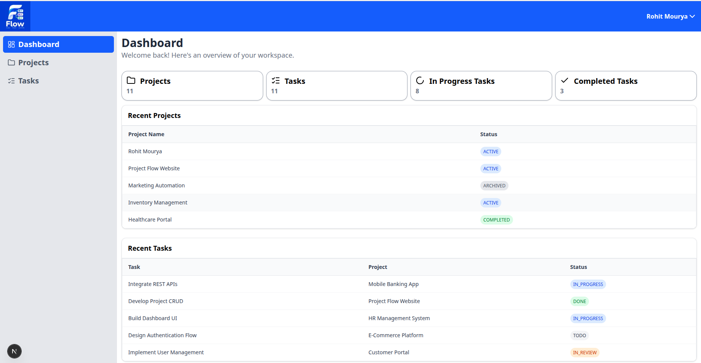
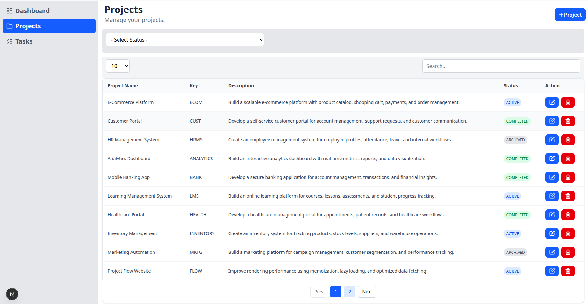
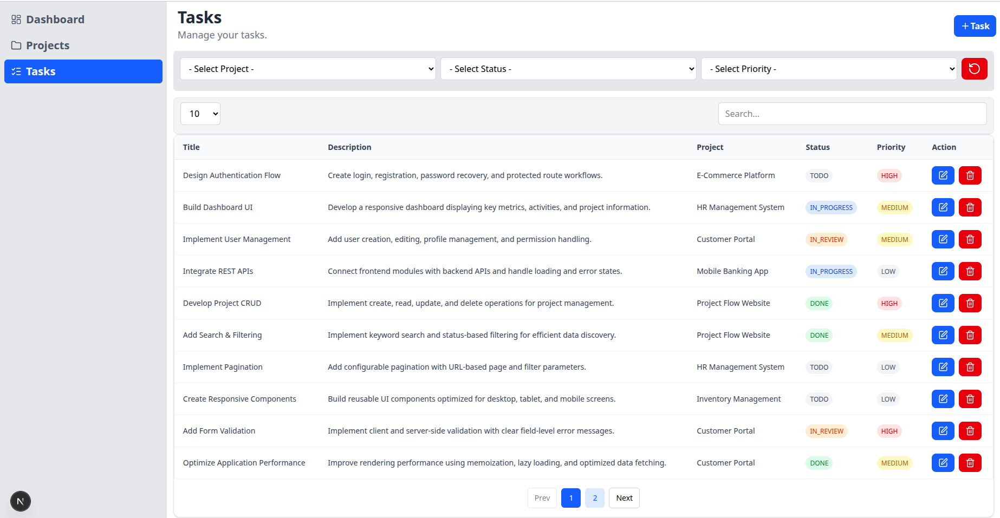
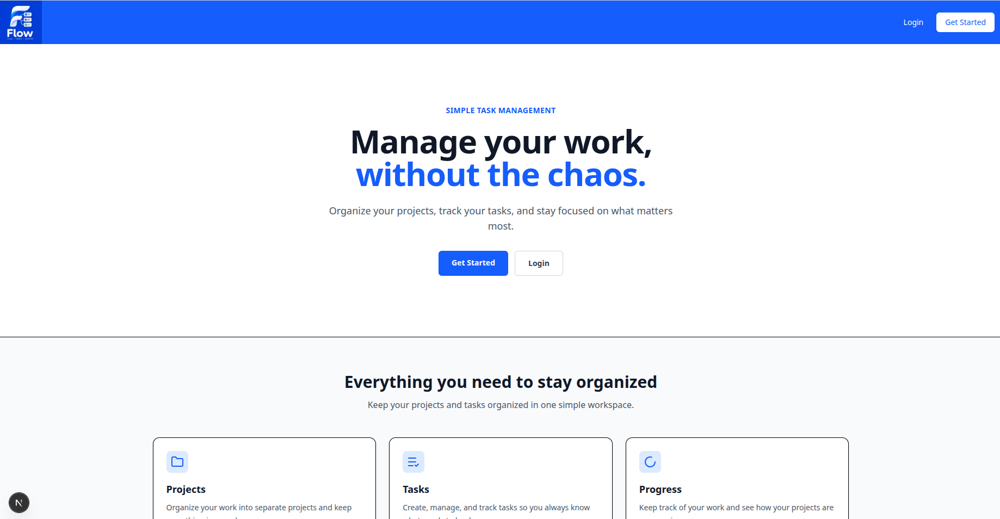
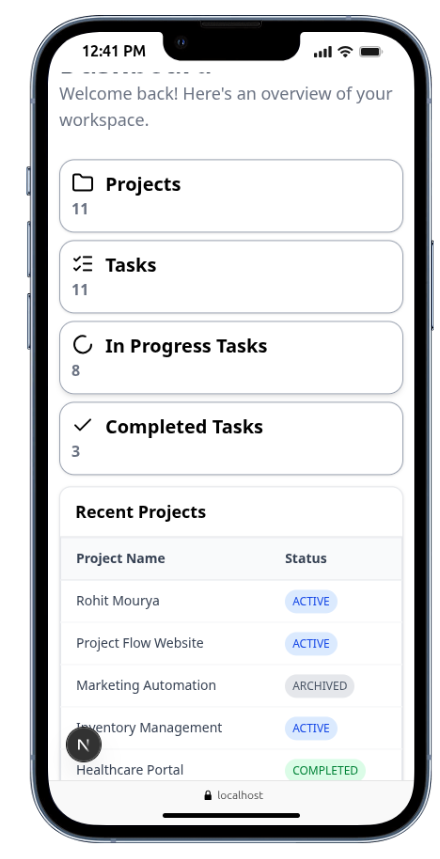
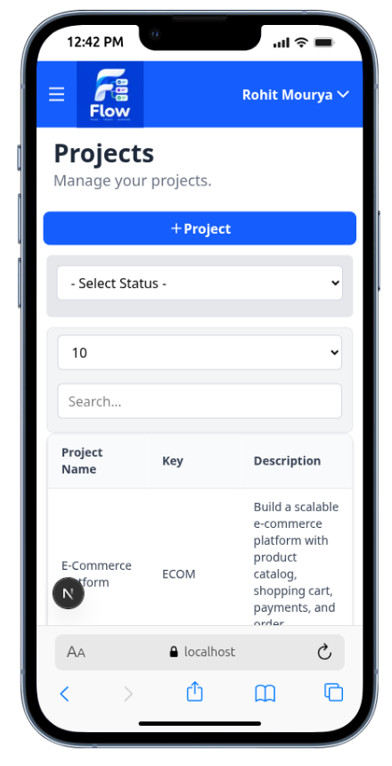
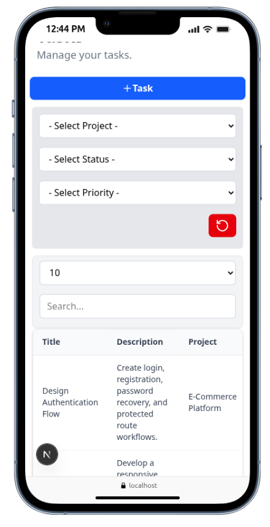
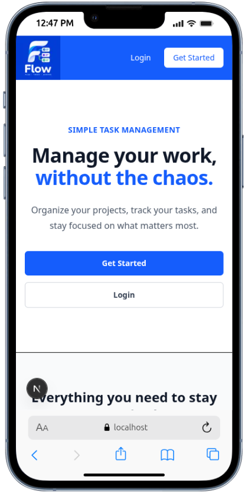

# 🚀 Project Flow

### Project & Task Management Application

Project Flow is a full-stack project and task management application built with **Next.js, TypeScript, React, MongoDB, and Redux Toolkit**.

It provides a structured way to create and manage projects, organize tasks, track project status, and manage project workflows through a responsive and user-friendly interface.

---

## 🌐 Live Demo

🔗 **Live Demo:** https://project-flow-v9ly.vercel.app/

📂 **GitHub:** https://github.com/MrRohitMI/project-flow

---

## ✨ Features

### 🔐 Authentication & Authorization

- User registration and login
- Secure password hashing
- JWT-based authentication
- Protected application routes
- User-specific project access

### 📁 Project Management

- Create new projects
- Edit existing projects
- Delete projects
- Manage project status
- Set project start and end dates
- Add project descriptions
- Project-level validation and error handling

### ✅ Task Management

- Create and manage tasks
- Organize tasks within projects
- Update task status
- Edit and delete tasks
- Task-level validation

### 🔎 Search & Filtering

- Search projects and tasks
- Filter projects by status
- Filter tasks based on workflow state
- URL-based query parameters
- Shareable filtered URLs

### 📄 Pagination

- Paginated project/task listings
- Configurable page size
- URL-based pagination
- Previous/Next navigation

### 🧩 Reusable UI Components

Built a reusable component system including:

- Button
- Input
- Select
- Textarea
- Forms
- Modals
- Tables
- Pagination
- Navigation components

### 🛡️ Form Validation

- Schema-based validation using **Zod**
- Server-side validation
- Field-level error messages
- Validation feedback in reusable form components

### 📱 Responsive UI

- Responsive layouts
- Mobile-friendly navigation
- Responsive forms and tables
- Tailwind CSS-based design system

---

## 🛠️ Tech Stack

### Frontend

- Next.js
- React
- TypeScript
- Tailwind CSS

### State Management

- Redux Toolkit
- React Redux

### Backend

- Next.js Server Actions
- Node.js
- MongoDB
- Mongoose

### Authentication

- JWT
- Password Hashing
- Protected Routes

### Validation

- Zod

### Testing

- Vitest
- React Testing Library

### Deployment

- Vercel

---

## 📸 Screenshots

### 🖥️ Desktop

| Dashboard | Projects |
|---|---|
|  |  |

| Tasks | Landing |
|---|---|
|  |  |

### 📱 Mobile

| Dashboard | Projects |
|---|---|
|  |  |

| Tasks | Landing |
|---|---|
|  |  |
## 🏗️ Application Architecture

Project Flow follows a modern full-stack Next.js architecture.

```text
                    ┌─────────────────────┐
                    │      Next.js UI     │
                    │ React + TypeScript  │
                    └──────────┬──────────┘
                               │
                               ▼
                    ┌─────────────────────┐
                    │   Client State      │
                    │   Redux Toolkit     │
                    └──────────┬──────────┘
                               │
                               ▼
                    ┌─────────────────────┐
                    │   Server Actions    │
                    │ Validation + Logic  │
                    └──────────┬──────────┘
                               │
                               ▼
                    ┌─────────────────────┐
                    │      Mongoose       │
                    │    Data Models      │
                    └──────────┬──────────┘
                               │
                               ▼
                    ┌─────────────────────┐
                    │      MongoDB        │
                    │      Database       │
                    └─────────────────────┘